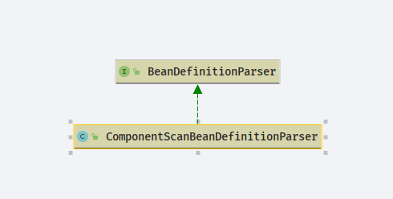

# Spring scan
- Author: [HuiFer](https://github.com/huifer)
- 源码阅读仓库: [huifer-spring](https://github.com/huifer/spring-framework-read)

## 解析
- Spring 注解形式使用有下面两种方式
    1. 通过`AnnotationConfigApplicationContext`参数:扫描包
    2. 通过xml配置`context:component-scan`属性`base-package`
```java
        AnnotationConfigApplicationContext aac =
                new AnnotationConfigApplicationContext("com.huifer.source.spring.ann");
```
```xml
    <context:component-scan base-package="com.huifer.source.spring.ann">
    </context:component-scan>
```

- 目标明确开始找入口方法
- `AnnotationConfigApplicationContext`直接点进去看就找到了
```java
public AnnotationConfigApplicationContext(String... basePackages) {
        this();
        // 扫描包
        scan(basePackages);
        refresh();
    }
```
- `context:component-scan`寻找方式:冒号`:`钱+NamespaceHandler 或者全文搜索`component-scan`,最终找到`org.springframework.context.config.ContextNamespaceHandler`
```java
public class ContextNamespaceHandler extends NamespaceHandlerSupport {

    @Override
    public void init() {
        registerBeanDefinitionParser("property-placeholder", new PropertyPlaceholderBeanDefinitionParser());
        registerBeanDefinitionParser("property-override", new PropertyOverrideBeanDefinitionParser());
        registerBeanDefinitionParser("annotation-config", new AnnotationConfigBeanDefinitionParser());
        registerBeanDefinitionParser("component-scan", new ComponentScanBeanDefinitionParser());
        registerBeanDefinitionParser("load-time-weaver", new LoadTimeWeaverBeanDefinitionParser());
        registerBeanDefinitionParser("spring-configured", new SpringConfiguredBeanDefinitionParser());
        registerBeanDefinitionParser("mbean-export", new MBeanExportBeanDefinitionParser());
        registerBeanDefinitionParser("mbean-server", new MBeanServerBeanDefinitionParser());
    }

}
```

### org.springframework.context.annotation.ComponentScanBeanDefinitionParser



- 实现`BeanDefinitionParser`直接看`parse`方法
```java
    @Override
    @Nullable
    public BeanDefinition parse(Element element, ParserContext parserContext) {
        // 获取 base-package 属性值
        String basePackage = element.getAttribute(BASE_PACKAGE_ATTRIBUTE);
        // 处理 ${}
        basePackage = parserContext.getReaderContext().getEnvironment().resolvePlaceholders(basePackage);
        // 分隔符`,;\t\n`切分
        String[] basePackages = StringUtils.tokenizeToStringArray(basePackage,
                ConfigurableApplicationContext.CONFIG_LOCATION_DELIMITERS);

        // Actually scan for bean definitions and register them.
        // 扫描对象创建
        ClassPathBeanDefinitionScanner scanner = configureScanner(parserContext, element);
        // 执行扫描方法
        Set<BeanDefinitionHolder> beanDefinitions = scanner.doScan(basePackages);
        // 注册组件,触发监听
        registerComponents(parserContext.getReaderContext(), beanDefinitions, element);

        return null;
    }

```

- 回过头看`AnnotationConfigApplicationContext`
### org.springframework.context.annotation.AnnotationConfigApplicationContext
```java
public AnnotationConfigApplicationContext(String... basePackages) {
        this();
        // 扫描包
        scan(basePackages);
        refresh();
    }
```
```java
   private final ClassPathBeanDefinitionScanner scanner;

    @Override
    public void scan(String... basePackages) {
        Assert.notEmpty(basePackages, "At least one base package must be specified");
        this.scanner.scan(basePackages);
    }

```
- `org.springframework.context.annotation.ClassPathBeanDefinitionScanner.scan`
```java
public int scan(String... basePackages) {

        // 获取bean数量
        int beanCountAtScanStart = this.registry.getBeanDefinitionCount();
        // 执行扫描
        doScan(basePackages);

        // Register annotation config processors, if necessary.
        if (this.includeAnnotationConfig) {
            AnnotationConfigUtils.registerAnnotationConfigProcessors(this.registry);
        }

        return (this.registry.getBeanDefinitionCount() - beanCountAtScanStart);
    }
```

- 这个地方`doScan`似曾相识,他就是`org.springframework.context.annotation.ComponentScanBeanDefinitionParser.parse`中的`doScan`,下一步解析doScan

### org.springframework.context.annotation.ClassPathBeanDefinitionScanner.doScan


```java
    protected Set<BeanDefinitionHolder> doScan(String... basePackages) {
        Assert.notEmpty(basePackages, "At least one base package must be specified");
        Set<BeanDefinitionHolder> beanDefinitions = new LinkedHashSet<>();
        for (String basePackage : basePackages) {
            // 寻找组件
            Set<BeanDefinition> candidates = findCandidateComponents(basePackage);
            for (BeanDefinition candidate : candidates) {
                // bean生命周期设置
                ScopeMetadata scopeMetadata = this.scopeMetadataResolver.resolveScopeMetadata(candidate);
                // 设置生命周期
                candidate.setScope(scopeMetadata.getScopeName());
                // 创建beanName
                String beanName = this.beanNameGenerator.generateBeanName(candidate, this.registry);
                if (candidate instanceof AbstractBeanDefinition) {
                    // 设置默认属性 具体方法:org.springframework.beans.factory.support.AbstractBeanDefinition.applyDefaults
                    postProcessBeanDefinition((AbstractBeanDefinition) candidate, beanName);
                }
                if (candidate instanceof AnnotatedBeanDefinition) {
                    // 读取Lazy，Primary 等注解
                    AnnotationConfigUtils.processCommonDefinitionAnnotations((AnnotatedBeanDefinition) candidate);
                }
                // bean的重复检查
                if (checkCandidate(beanName, candidate)) {
                    // 创建 BeanDefinitionHolder
                    BeanDefinitionHolder definitionHolder = new BeanDefinitionHolder(candidate, beanName);
                    // 代理对象的处理
                    definitionHolder =
                            AnnotationConfigUtils.applyScopedProxyMode(scopeMetadata, definitionHolder, this.registry);
                    // 放入list中,最后返回用
                    beanDefinitions.add(definitionHolder);
                    // 注册bean
                    registerBeanDefinition(definitionHolder, this.registry);
                }
            }
        }
        return beanDefinitions;
    }

```


#### org.springframework.context.annotation.ClassPathScanningCandidateComponentProvider#findCandidateComponents

```java
    public Set<BeanDefinition> findCandidateComponents(String basePackage) {
        // 扫描
        if (this.componentsIndex != null && indexSupportsIncludeFilters()) {
            return addCandidateComponentsFromIndex(this.componentsIndex, basePackage);
        }
        else {
            return scanCandidateComponents(basePackage);
        }
    }

```


