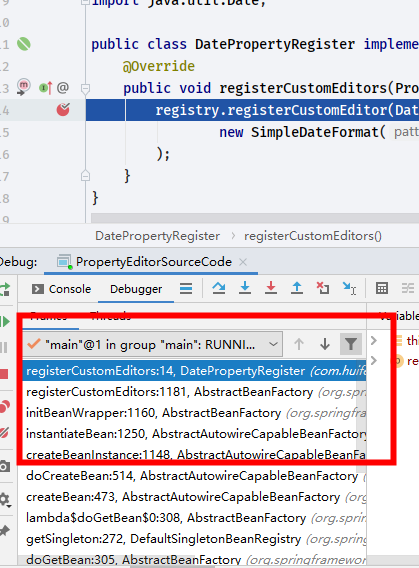
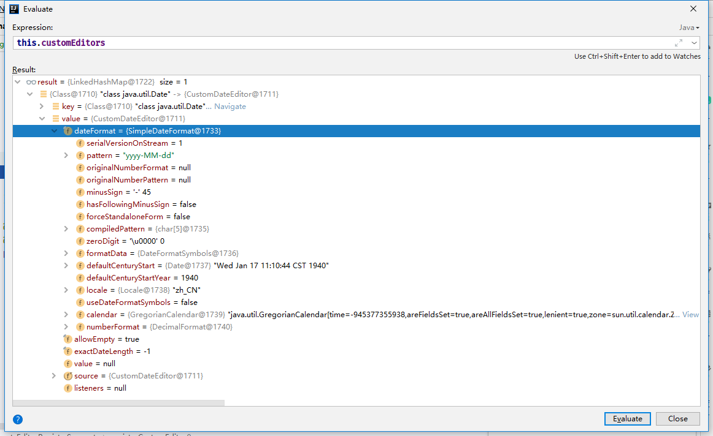
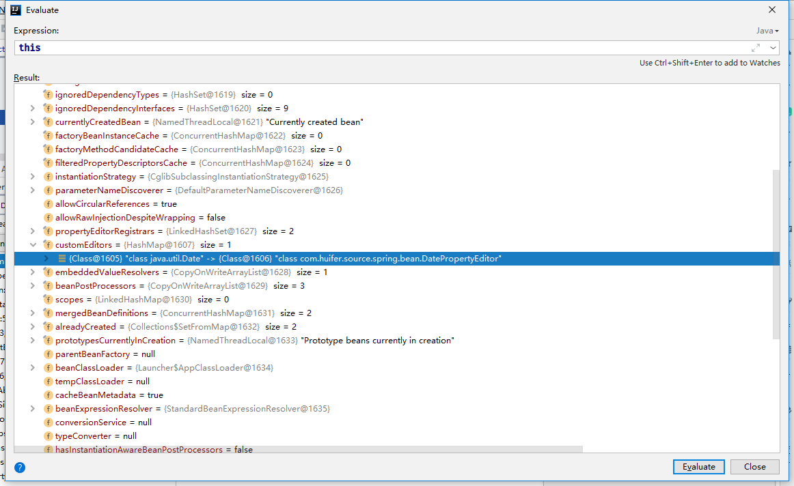

# Spring 自定义属性解析器
- Author: [HuiFer](https://github.com/huifer)
- 源码阅读仓库: [huifer-spring](https://github.com/huifer/spring-framework-read)

## 用例
```xml
<?xml version="1.0" encoding="UTF-8"?>
<beans xmlns:xsi="http://www.w3.org/2001/XMLSchema-instance"
       xmlns="http://www.springframework.org/schema/beans"
       xsi:schemaLocation="http://www.springframework.org/schema/beans http://www.springframework.org/schema/beans/spring-beans.xsd">

    <bean class="org.springframework.beans.factory.config.CustomEditorConfigurer">
        <property name="propertyEditorRegistrars">
            <list>
                <bean class="com.huifer.source.spring.bean.DatePropertyRegister"/>
            </list>
        </property>

        <property name="customEditors">
            <map>
                <entry key="java.util.Date" value="com.huifer.source.spring.bean.DatePropertyEditor">
                </entry>
            </map>
        </property>
    </bean>
    <bean id="apple" class="com.huifer.source.spring.bean.Apple">
        <property name="date" value="2020-01-01 01:01:01"/>
    </bean>
</beans>
```

```java
public class DatePropertyRegister implements PropertyEditorRegistrar {
    @Override
    public void registerCustomEditors(PropertyEditorRegistry registry) {
        registry.registerCustomEditor(Date.class, new CustomDateEditor(
                new SimpleDateFormat("yyyy-MM-dd"), true)
        );
    }
}
```

```java
public class DatePropertyEditor extends PropertyEditorSupport {
    private String format = "yyyy-MM-dd";

    public String getFormat() {
        return format;
    }

    public void setFormat(String format) {
        this.format = format;
    }

    @Override
    public void setAsText(String text) throws IllegalArgumentException {
        System.out.println(text);
        SimpleDateFormat sdf = new SimpleDateFormat(format);
        try {
            Date date = sdf.parse(text);
            this.setValue(date);
        } catch (Exception e) {
            e.printStackTrace();

        }
    }

}
```

## PropertyEditorRegistrar解析
- 直接在`DatePropertyRegister`打上断点进行查看注册流程

  

  直接看调用堆栈获取调用层次

```java
    @Override
    public void registerCustomEditor(Class<?> requiredType, PropertyEditor propertyEditor) {
        registerCustomEditor(requiredType, null, propertyEditor);
    }

```


```java
    @Override
    public void registerCustomEditor(@Nullable Class<?> requiredType, @Nullable String propertyPath, PropertyEditor propertyEditor) {
        if (requiredType == null && propertyPath == null) {
            throw new IllegalArgumentException("Either requiredType or propertyPath is required");
        }
        if (propertyPath != null) {
            if (this.customEditorsForPath == null) {
                this.customEditorsForPath = new LinkedHashMap<>(16);
            }
            this.customEditorsForPath.put(propertyPath, new CustomEditorHolder(propertyEditor, requiredType));
        }
        else {
            if (this.customEditors == null) {
                this.customEditors = new LinkedHashMap<>(16);
            }
            // 放入 customEditors map对象中
            this.customEditors.put(requiredType, propertyEditor);
            this.customEditorCache = null;
        }
    }

```

- `PropertyEditorRegistrySupport`

  

  此处对象是通过`DatePropertyRegister`传递的

- `org.springframework.beans.factory.support.AbstractBeanFactory#registerCustomEditors`

```java
    protected void registerCustomEditors(PropertyEditorRegistry registry) {
        PropertyEditorRegistrySupport registrySupport =
                (registry instanceof PropertyEditorRegistrySupport ? (PropertyEditorRegistrySupport) registry : null);
        if (registrySupport != null) {
            registrySupport.useConfigValueEditors();
        }
        if (!this.propertyEditorRegistrars.isEmpty()) {
            for (PropertyEditorRegistrar registrar : this.propertyEditorRegistrars) {
                try {
                    /**
                     * {@link ResourceEditorRegistrar#registerCustomEditors(org.springframework.beans.PropertyEditorRegistry)}或者
                     * {@link PropertyEditorRegistrar#registerCustomEditors(org.springframework.beans.PropertyEditorRegistry)}
                     */
                    registrar.registerCustomEditors(registry);
                }
                catch (BeanCreationException ex) {
                    Throwable rootCause = ex.getMostSpecificCause();
                    if (rootCause instanceof BeanCurrentlyInCreationException) {
                        BeanCreationException bce = (BeanCreationException) rootCause;
                        String bceBeanName = bce.getBeanName();
                        if (bceBeanName != null && isCurrentlyInCreation(bceBeanName)) {
                            if (logger.isDebugEnabled()) {
                                logger.debug("PropertyEditorRegistrar [" + registrar.getClass().getName() +
                                        "] failed because it tried to obtain currently created bean '" +
                                        ex.getBeanName() + "': " + ex.getMessage());
                            }
                            onSuppressedException(ex);
                            continue;
                        }
                    }
                    throw ex;
                }
            }
        }
        if (!this.customEditors.isEmpty()) {
            this.customEditors.forEach((requiredType, editorClass) ->
                    registry.registerCustomEditor(requiredType, BeanUtils.instantiateClass(editorClass)));
        }
    }

```

- `void registerCustomEditors(PropertyEditorRegistry registry);` 用例中编写的`DatePropertyRegister`正好有这个方法的实现

·

- 在`AbstractBeanFactory`中查看变量




- 为什么最后结果变成`com.huifer.source.spring.bean.DatePropertyEditor`

  看配置文件

  ```xml
          <property name="customEditors">
              <map>
                  <entry key="java.util.Date" value="com.huifer.source.spring.bean.DatePropertyEditor">
                  </entry>
              </map>
          </property>
  
  ```

  - 对应的set方法

    ```java
        public void setCustomEditors(Map<Class<?>, Class<? extends PropertyEditor>> customEditors) {
            this.customEditors = customEditors;
        }
    ```

    


