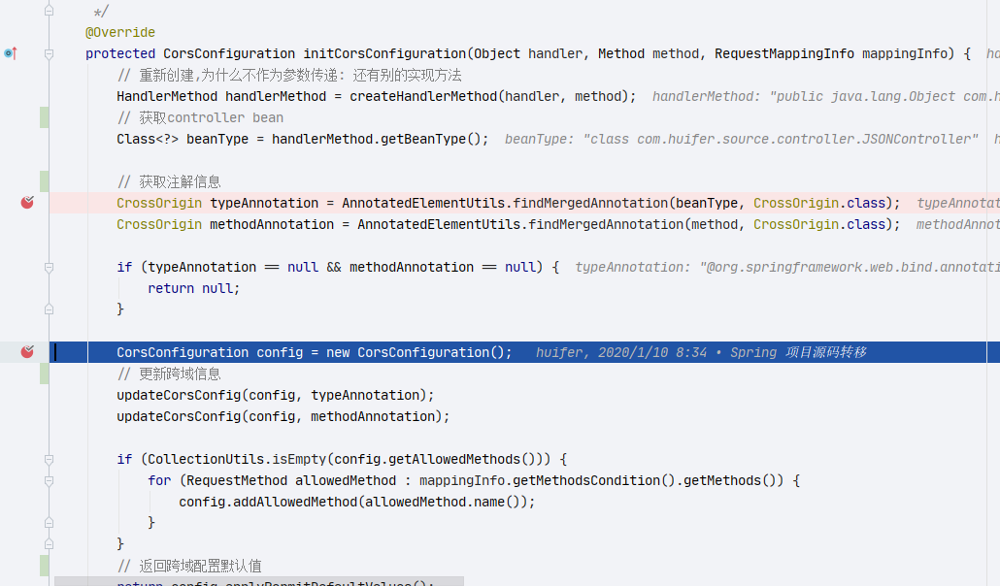
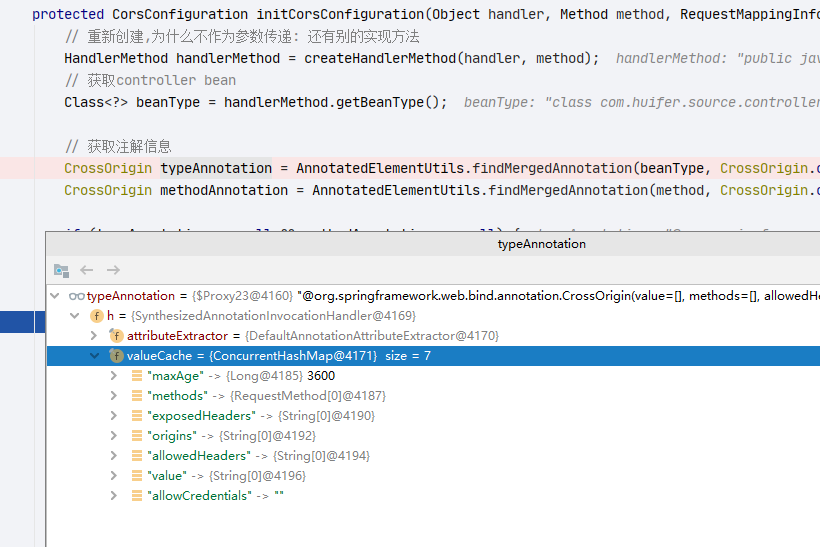
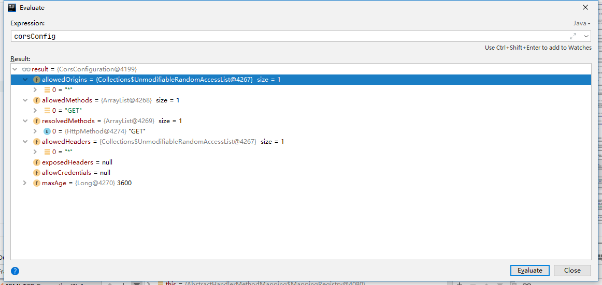

# Spring-MVC 跨域


## CrossOrigin注解

- 通过注解设置跨域 demo 如下

```java
package com.huifer.source.controller;

import org.springframework.web.bind.annotation.*;

import java.util.HashMap;

@CrossOrigin(maxAge = 3600)
@RequestMapping("/")
@RestController
public class JSONController {
    @ResponseBody
    @GetMapping(value = "/json")
    public Object ob() {
        HashMap<String, String> hashMap = new HashMap<>();
        hashMap.put("1", "a");
        return hashMap;
    }
}

```


- 切入点: 

  - `org.springframework.web.servlet.handler.AbstractHandlerMethodMapping#registerHandlerMethod`

    - `org.springframework.web.servlet.handler.AbstractHandlerMethodMapping.MappingRegistry#register`方法

    ```java
            /**
             * 注册方法 将controller 相关信息存储
             *
             * @param mapping 请求地址
             * @param handler 处理类
             * @param method  函数
             */
            public void register(T mapping, Object handler, Method method) {
                // 上锁
                this.readWriteLock.writeLock().lock();
                try {
                    // 创建 HandlerMethod , 通过 handler 创建处理的对象(controller)
                    HandlerMethod handlerMethod = createHandlerMethod(handler, method);
                    assertUniqueMethodMapping(handlerMethod, mapping);
                    // 设置值
                    this.mappingLookup.put(mapping, handlerMethod);
    
                    // 获取url
                    List<String> directUrls = getDirectUrls(mapping);
                    for (String url : directUrls) {
                        // 设置
                        this.urlLookup.add(url, mapping);
                    }
    
                    String name = null;
                    if (getNamingStrategy() != null) {
                        name = getNamingStrategy().getName(handlerMethod, mapping);
                        addMappingName(name, handlerMethod);
                    }
    
                    /**
                     * 跨域设置
                     * {@link org.springframework.web.servlet.mvc.method.annotation.RequestMappingHandlerMapping#initCorsConfiguration(Object, Method, RequestMappingInfo)}
                     **/
                    CorsConfiguration corsConfig = initCorsConfiguration(handler, method, mapping);
                    if (corsConfig != null) {
                        this.corsLookup.put(handlerMethod, corsConfig);
                    }
    
                    this.registry.put(mapping, new MappingRegistration<>(mapping, handlerMethod, directUrls, name));
                }
                finally {
                    // 开锁
                    this.readWriteLock.writeLock().unlock();
                }
            }
    
    ```

- 着重查看**`CorsConfiguration`**初始化方法

  - `org.springframework.web.servlet.mvc.method.annotation.RequestMappingHandlerMapping#initCorsConfiguration`

```JAVA
@Override
    protected CorsConfiguration initCorsConfiguration(Object handler, Method method, RequestMappingInfo mappingInfo) {
        // 重新创建,为什么不作为参数传递: 还有别的实现方法
        HandlerMethod handlerMethod = createHandlerMethod(handler, method);
        // 获取bean
        Class<?> beanType = handlerMethod.getBeanType();

        // 获取注解信息
        CrossOrigin typeAnnotation = AnnotatedElementUtils.findMergedAnnotation(beanType, CrossOrigin.class);
        CrossOrigin methodAnnotation = AnnotatedElementUtils.findMergedAnnotation(method, CrossOrigin.class);

        if (typeAnnotation == null && methodAnnotation == null) {
            return null;
        }

        CorsConfiguration config = new CorsConfiguration();
        // 更新跨域信息
        updateCorsConfig(config, typeAnnotation);
        updateCorsConfig(config, methodAnnotation);

        if (CollectionUtils.isEmpty(config.getAllowedMethods())) {
            for (RequestMethod allowedMethod : mappingInfo.getMethodsCondition().getMethods()) {
                config.addAllowedMethod(allowedMethod.name());
            }
        }
        // 返回跨域配置默认值
        return config.applyPermitDefaultValues();
    }
```


信息截图:






### updateCorsConfig

- 该方法对原有的配置信息做补充

```java
    private void updateCorsConfig(CorsConfiguration config, @Nullable CrossOrigin annotation) {
        if (annotation == null) {
            return;
        }
        for (String origin : annotation.origins()) {
            config.addAllowedOrigin(resolveCorsAnnotationValue(origin));
        }
        for (RequestMethod method : annotation.methods()) {
            config.addAllowedMethod(method.name());
        }
        for (String header : annotation.allowedHeaders()) {
            config.addAllowedHeader(resolveCorsAnnotationValue(header));
        }
        for (String header : annotation.exposedHeaders()) {
            config.addExposedHeader(resolveCorsAnnotationValue(header));
        }

        String allowCredentials = resolveCorsAnnotationValue(annotation.allowCredentials());
        if ("true".equalsIgnoreCase(allowCredentials)) {
            config.setAllowCredentials(true);
        }
        else if ("false".equalsIgnoreCase(allowCredentials)) {
            config.setAllowCredentials(false);
        }
        else if (!allowCredentials.isEmpty()) {
            throw new IllegalStateException("@CrossOrigin's allowCredentials value must be \"true\", \"false\", " +
                    "or an empty string (\"\"): current value is [" + allowCredentials + "]");
        }

        if (annotation.maxAge() >= 0 && config.getMaxAge() == null) {
            config.setMaxAge(annotation.maxAge());
        }
    }

```


最终解析结果




- 解析完成后放入	`corsLookup`对象中 类:**`org.springframework.web.servlet.handler.AbstractHandlerMethodMapping`**

  ```java
                  if (corsConfig != null) {
                      this.corsLookup.put(handlerMethod, corsConfig);
                  }
  
  ```

  


## xml 配置方式